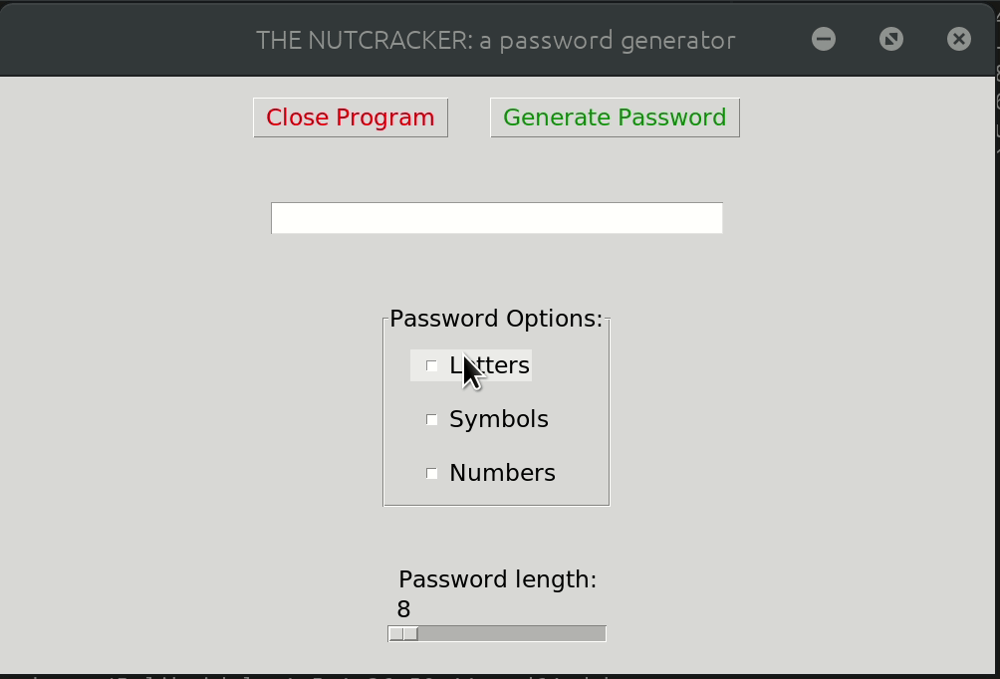

# Nutcracker: A password generator

**Life hack:** The most secure and fastest way to forget your password is to randomly generate
it! So good, you'll hopefully never be able to access your account again. 
 
**Double life hack:** Use this to also generate your username for games. It's a great way
for people to underestimate you in-game because they'll think you're a bot. Additional
bonus if you're a terrible player, they'll never know...
 
**Triple life hack:** Spice up your life and use this to also generate baby names if you're
into that stuff, no one will to be able to pronounce it but hey, at least it's exotic.

 *<= Python 3.6*
 
 ## Setup
 - Clone the repo
 - Make sure you have python3.6 installed
 - To run:
 ```
 cd ~/nutcracker/app
 python3 app.py
 ```
 Alternatively, if you just want to use the app, simply double click the app executable 
 the `~/nutcracker/password_generator` folder (for linux only). 
 
 To see how the password gets generated, have a look at `password_generator.py`


